# e-lang


`e-lang` is an experimental programming language that provides higher level abstractions specific to the needs of engineering disciplines.

## Getting Started

The best way to try `e-lang` is to install the [VSCode extension](https://marketplace.visualstudio.com/items?itemName=EngineersTools.e-lang). This includes an interpreter that runs e-lang notebook (\*.elnb) files (see the [examples](./examples/) folder).

### Installing CLI

`e-lang` includes a basic CLI tool. Currently the only implemented command is `run`, which interprets a program and returns any `print` statements to the console.

To install the CLI run:

```cmd
npm i -g @eng-tools/e-lang@latest
```

To run a file, type:

```cmd
elang run ./path/to/your/file.elng
```

This is an alpha version and it should not be used in production.

## Documentation

Documentation is being built on the GitHub repo whilst a documentation site is being prepared. Head to the [docs](./docs/) folder to read about the core concepts and features that comprise `e-lang`.

## Examples

The [examples](./examples/) folder contains e-lang notebooks with explanations and demonstrations of the various features of this language.

## Language Summary

### File Types

| Extension | Use for |
|-----|-----|
|`.elng`| Contains elang code and can be run with the CLI interpreter |
|`.elnb`| This is a notebook format that runs an elang interpreter on VSCode |


### Import and export

To facilitate file organisation, each file can include a range of `import` statements. Each statement would be followed by the relative of the file that contains the entities to be imported.

The `.elng` file extension can be safely omitted from the file name.

```
import './units'
import './helpers'
```

The entities that will be available if the file is imported have to be explicitly exported from the source file.

```
// File: units.elng

export unit_family Temperature {
    unit degC:DegreeCelsius
    unit degF:DegreeFahrenheit

    conversion degC->degF: (val) => ((9/5) * val) + 32
    conversion degF->degC: (val) => (5/9) * (val - 32)
}
```

The following entities are exportable: `const`, `var`, `model`, `unit_family`, `formula`, `procedure`.


### Print statement

Print a message to the console or the notebook outputs

```
print "Hello World!"

> Hello World
```

#### Concatenation

In order to concatenate sting values, use the `+` operator.

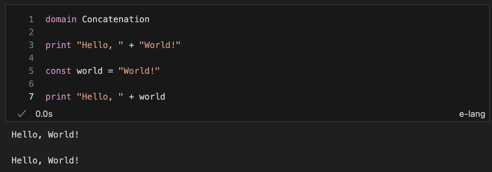


### Variable Declaration

The `const` keyword declares constants. The `var` keyword declared variables. Constants are immutable values and cannot be changed throughout their lifetime.

``` ts
const constantValue = 10
var variableValue = "Ten"
```

Trying to reassign a value to a constant will result in a validation and runtime error.

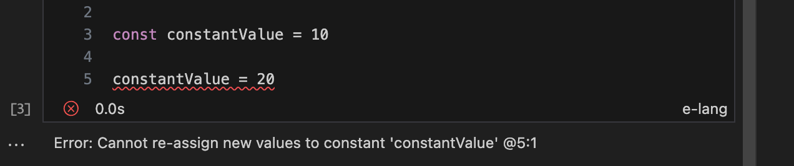

### Models

A `model` is a type declaration that holds other properties within it. Each model property has a name, a type and an optional text description. In addition, the property can be optional, meaning that an instance of that model can safely omit the value of that property. Properties are marked as optional with the `?` character.

```
model Asset {
    id: number "The unique identifier of this asset"
    name: text "A short, human readable, reference to the asset"
    description?: text "A longer form description of the asset"
}
```

The type of each property can be a primitive (`number`, `text`, `boolean`), another `model`, a `union` of types or a `list` of any of these.

```
model GPSLocation {
    lat: number
    lon: number
}

model AssetLocation  {
    address: text
    gpsLocation: GPSLocation
    previousLocations: GPSLocation list
    createdDate: number or text
}
```

#### Inheritance

Models can inherit properties from one or more parent models. A parent model is declared using the `extends` keyword after the name of the declared `model`.

If the `model` defines a property already contained in the chain of parent models, the property will be highlighted as invalid. If this is the intent, the property has to be marked with the `override` keyword.

```
model PowerTransformer extends Asset {
    override id: text
    sides: number
    connectionGroup: text
}
```

### Units of Measure

`elang` allows the declaration of unit families, units of measure and the conversions between them.

To declare a unit family, use the `unit_family` keyword.

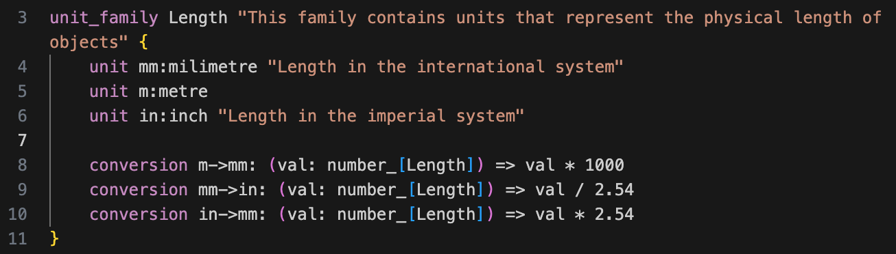

A `unit_family` needs a name and an optional description.

Inside the scope of a `unit_family`, the keyword `unit` declares a new unit of measure belonging to this family. Each `unit` needs a minimum of a short name (i.e. `mm`) a longer name (i.e. `millimetre`) and an optional text description.

Also in the scope of a `unit_family`, the conversion of one unit to another is declared using the `conversion` keyword. Each conversion should at least take one argument with the value in the `unit` to be converted **from** and should return the value in the `unit` to be converted **to**.

The symbol `->` is used to denote this **from unit to unit** relationship.

The calculation of this conversion can be declared in place using a `lambda` notation or it can be a reference to a `formula` in other part of the code.

For example, to convert from millilitres to inches, the conversion could be declared like this:

`conversion mm->in: (val: number_[Length]) => val / 2.54`

In this case, think of `mm->in` as the name of the `conversion`, signifying **from millimetres to inches**.

It would also be valid to declare the conversion as a `formula` and use it later in the conversion declaration.

```
formula fromMillimetreToInches(val: number_[Length]) returns number_[Length] {
    return val / 2.54
} 
```

Inside a `unit_family` declaration, this formula could be used as follows:

`conversion mm->in: fromMillimetreToInches`

These two `conversion` declarations are equivalent.

#### Units as types

To declare a value or parameter that is a measurement with a value and a unit, rather than just a `number`, use the `number_[UnitFamilyName]` notation.

For example, if you want to declare a variable called `height` that uses the unit family `Length`, you can do it as follows.

`var height: number_[Length]`

If you would like to assign a value to a variable that uses a unit of measure, you would use the `number_[unit]` syntax.

For example: 

`height = 1000_[mm]`

Declaring the correct unit family in the type of a variable provides typechecking safety when the program is being written. If a value with the incorrect units is assigned to a variable, a validation error would be generated.

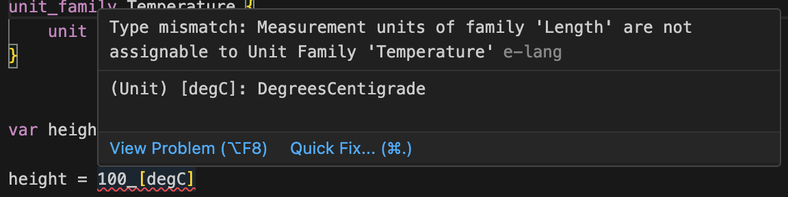

#### Unit Conversions

Units can be converted on the spot using the unit conversion operator `->`.

For example:

```ts
// Convert height from [mm] to [in] and print the result 

print height->in

out> 393.7007874015748_[in]
```

The unit conversion operator can be chained to perform multiple conversions:

`height->in->mm`

#### Unit Operations

A measurement type (`number_[UnitFamily]`) can be used in operations with scalar values (`number`) and other measurements.

If the operation expression mixes measurements in various units, the result of the operation will be expressed in the units of the last (right-most) unit in the operation expression.

For example:

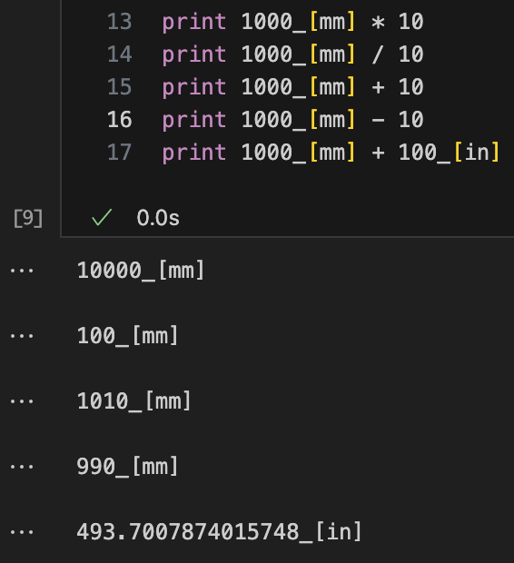

An attempt to perform operations with incompatible units, i.e. units from different families, will produce a unit conversion error.

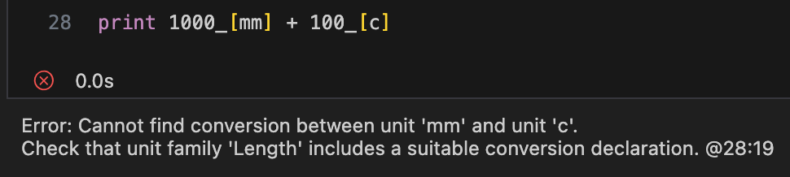

#### Conversion between unit families

To convert units between families, a `conversion` can be declared that takes in values in one unit and outputs in another.

For example, the multiplication of units of the family `Length` would map to a result in the units of the family `Area`.

A `conversion` declaration can accept additional parameters. When the conversion is called, these additional parameters are placed in parenthesis after calling the unit conversion `->` operator.

For example:

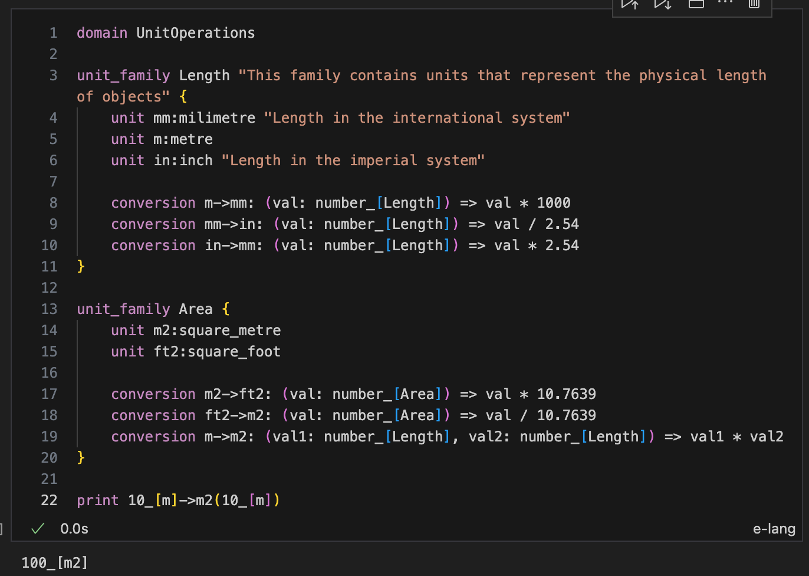

### Lists

A list of values can be declared by appending the keyword `list` to any of the primitive types, union of types or declared `model`.

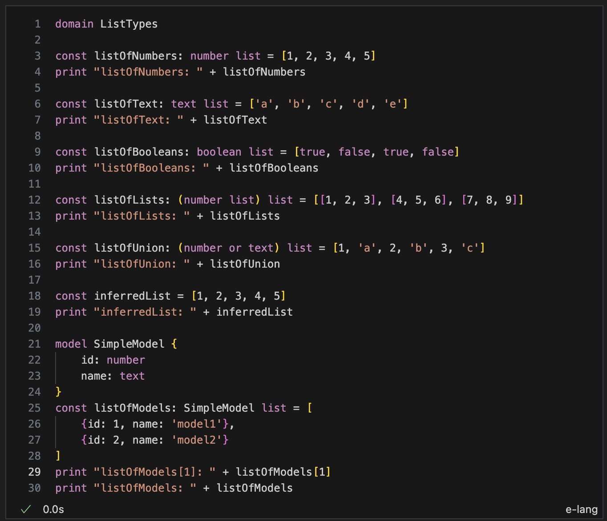

To access the element of a `list` square brackets `[]` after the name of the name of the list should contain an integer value indicating the element of the list that needs to be accessed.

In `elang`, the first element of the list can be accessed with `[1]`.

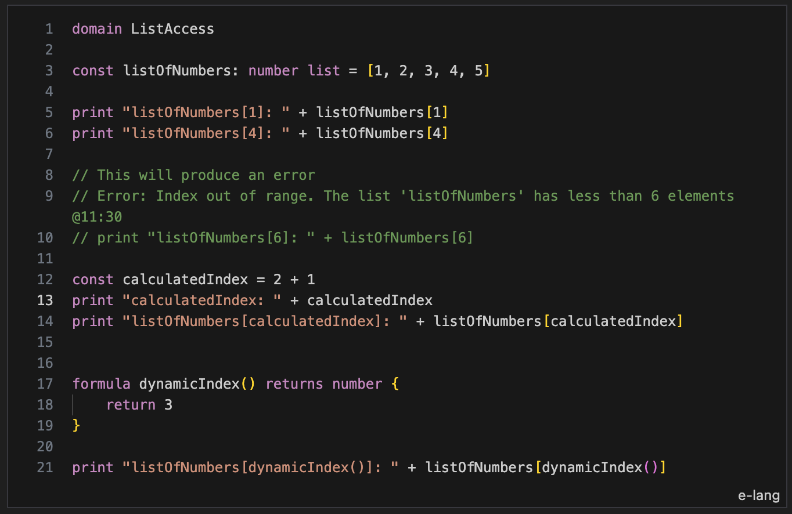

If the value of a list is not assigned when declared, it means the list will be mutated later and needs to be declared with the `var` keyword.

If the list is initialised with an empty list `[]`, a type has to be included in the declaration. Otherwise the later assignment of elements will produce an error.

If a value is assigned to a list element with an `index` that is larger than the number of elements in the list, the elements between the last current element and the new one will be filled with the value `null`.

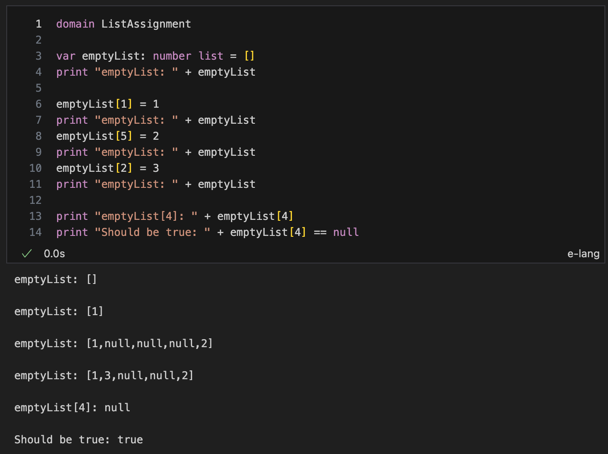


#### List manipulation formulas

`elang` includes three formulas that manipulate an existing `list`.

The `listCount()` formula takes a list as an input and returns the number of elements in the list.

Like any other expression, the result of this formula can be assigned to a variable for further use in the program.

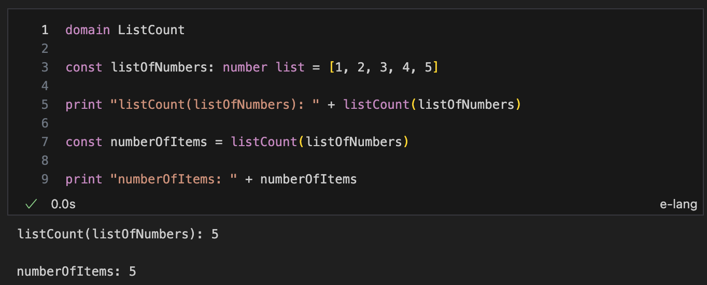

The `listAdd(list, element)` and `listRemove(list, index?)` formulas return a list with elements appended and removed respectively.

The `listAdd(list, element)` formula takes two arguments:
- `list` is the list that will be used as a basis for the add operation, and
- `element` is the new element that will be appended at the end of the list. The type of this item has to be compatible with the types of the list, `elang` will throw an error otherwise.

This formula returns a new `list` with the added `element`.

The `listRemove(list,index?)` formula takes one mandatory argument and one optional argument:
- The `list` argument is mandatory and is the list from which the element will be removed
- The `index` argument is an optional argument that contains a number. This represents the index of the element that should be removed from the list. If the argument is absent, the formula will remove the last element of the list. Also, if the index is larger than the size of the list, no `element` will be removed and the same `list` will be returned.

This formula returns a new `list` without the removed element removed at `index`.

Both of these formulas return a new `list` and do not modify the `list` that was used as an input.

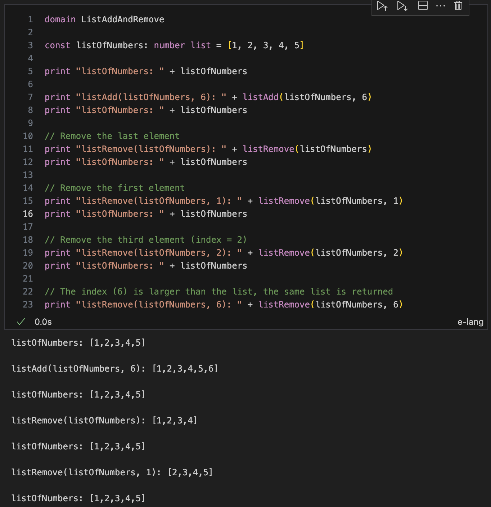

A `list` can be iterated using a `for` loop and the `listCount` formula.

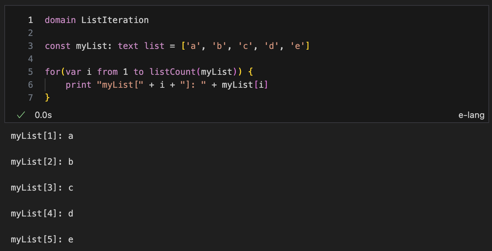

### Formulas and Procedures

In `elang` computations can be grouped using formulas and procedures.

Both a `formula` and a `procedure` encapsulate statement blocks. The difference is that a `formula` has declare and return a value whilst a `procedure` might or might not declare and return a value.

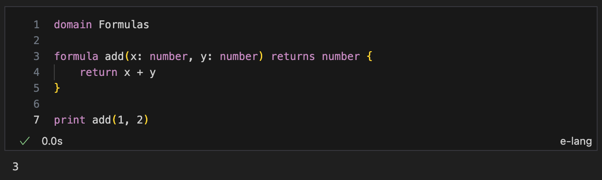

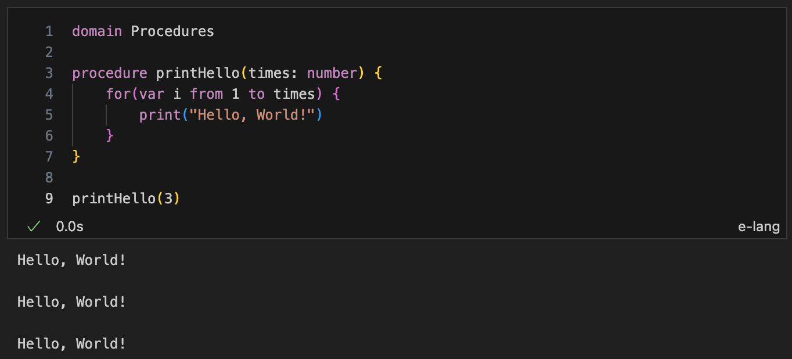

### Program Flow

`elang` has a range of statements that can be used to control the program flow.

#### If/Else statement

The `if` keyword specifies a block of statements that executes when the expression between parenthesis is `true`. An optional `else` keyword specifies a block of statement that executes if the expression is `false`.

The expression used on an `if` statement has to evaluate to a boolean result.

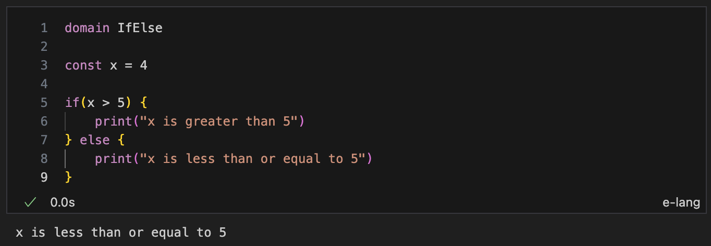

Boolean comparisons can be done using the following operators:

- `==` operands are equal
- `!=` operands are not equal
- `>` left operand is greater than the right operand
- `>=` left operand is greater or equal than the right operand
- `<` left operand is lesser than the right operand
- `<=` left operand is lesser or equal than the right operand

Boolean operations can be performed with the `or` or `and` keywords.

#### For loop statement

The `for` keyword declares a block of statements that will be repeated a number of times.

The declaration of a `for` loop includes the name of a variable that is scoped to the statement block and the `from` and `to` values/expressions. An optional `step` keyword can specify the value of the increment applied to the variable between loops. If omitted, each loop the variable is incremented by one.

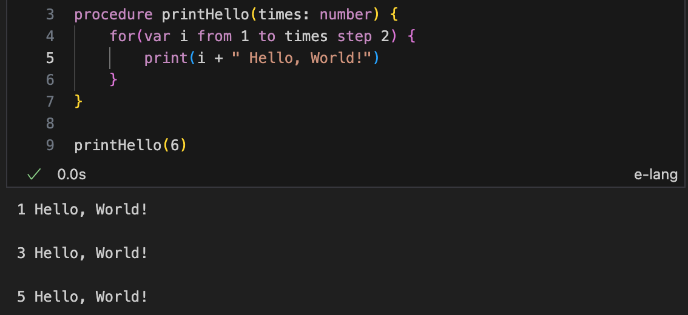

#### Match statement

The `match` keyword is used to declare a range of options that can be used to run a statement block when the input value matches one of the options.

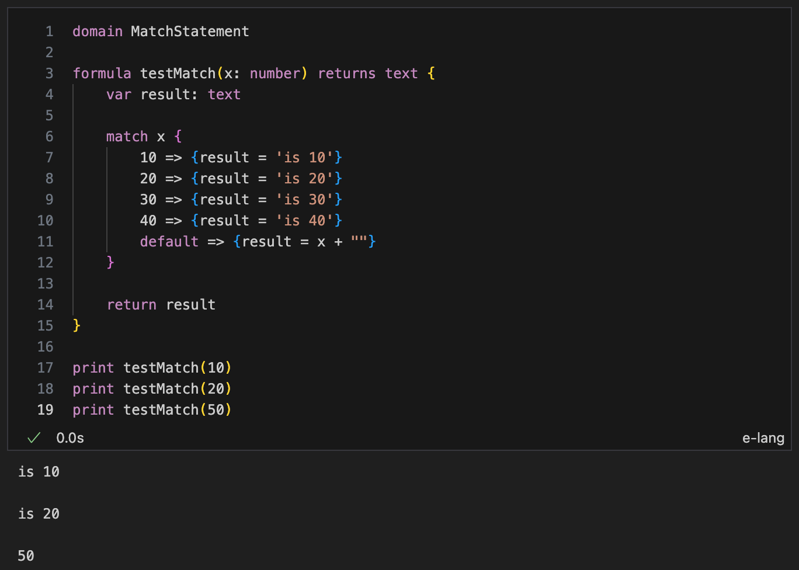
