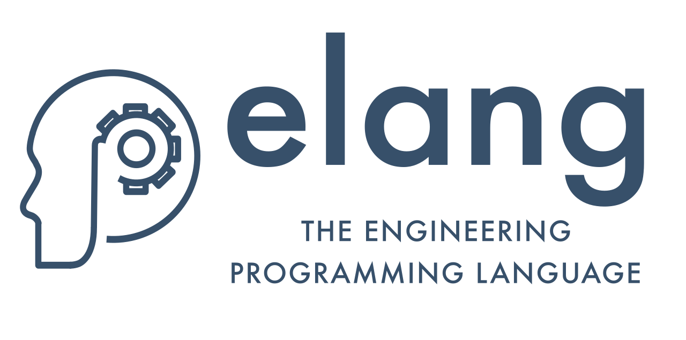

# elang

`elang` is an experimental programming language that provides higher level abstractions specific to the needs of engineering disciplines.

The best way to try elang is to install the [VSCode extension](https://marketplace.visualstudio.com/items?itemName=EngineersTools.e-lang). This includes an interpreter that runs elang notebook (\*.elnb) files (see the [examples](./examples/) folder).

This is an alpha version and it should not be used in production.

Documentation is being built on the GitHub repo whilst a documentation site is being prepared. Head to the [docs](./docs/) folder to read about the core concepts and features that comprise `elang`.

The [examples](./examples/) folder contains elang notebooks with explanations and demonstrations of the various features of this language.
