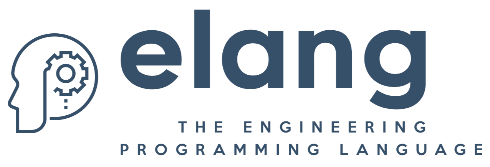

# elang

elang is an experimental programming language that provides higher level abstractions specific to the needs of engineering disciplines.

The best way to try elang is to install the VSCode extension.